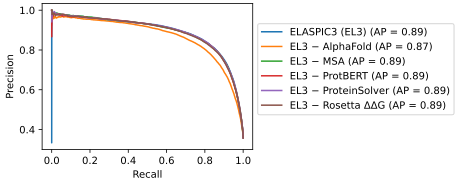
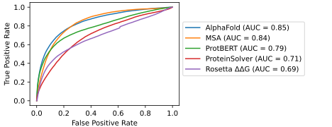
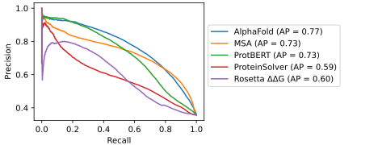

# CAGI6 community assessment

- [Introduction](#introduction)
- [Methods](#methods)
  - [Feature generation](#feature-generation)
  - [Final model performance](#final-model-performance)
  - [Ablation experiments](#ablation-experiments)
  - [Supervised performance](#supervised-performance)
  - [Unsupervised (one-shot) performance](#unsupervised-one-shot-performance)
- [Individual submissions](#individual-submissions)
  - [Calmodulin](#calmodulin)
  - [MAPK1](#mapk1)
  - [MAPK3](#mapk3)
  - [MTHFR](#mthfr)
  - [HMBS](#hmbs)
  - [Sherloc clinical classification](#sherloc-clinical-classification)
- [References](#references)

## Introduction

**_ELASPIC3 (EL3)_** is a gradient-boosted decision tree model which uses features generated using pretrained deep neural networks to predict the effect of mutations. In contrast to its predecessor ELASPIC2 [1], ELASPIC3 incorporates features extracted from multiple sequence alignments (MSAs), including the embeddings produced by AlphaFold [5]. ELASPIC3 is trained solely to predict whether a mutation is deleterious or benign, using mutations in the UniParc [humsavar.txt](https://www.uniprot.org/docs/humsavar.txt) file and the CAGI6 Sherloc dataset as the training data.

## Methods

### Feature generation

| Name          | Description                                                                                                                                                                                                                                          |
| ------------- | ---------------------------------------------------------------------------------------------------------------------------------------------------------------------------------------------------------------------------------------------------- |
| AlphaFold     | AlphaFold [5] is a deep neural network which takes as input an MSA and, optionally, structural templates, and predicts the structure of the protein as well as other properties, including the probability distribution for each residue in the MSA. |
| MSA           | The multiple sequence alignment (MSA) is processed to extract various statistics, including the number of times the wild type and mutant residues appear in a given position.                                                                        |
| ProtBERT      | ProtBERT [3] is a deep neural network trained to reconstruct masked amino acids in millions of protein sequences.                                                                                                                                    |
| ProteinSolver | ProteinSolver [2] is a graph neural network trained to reconstruct masked amino acids given the distagram describing the topology of the protein.                                                                                                    |
| Rosetta ΔΔG   | Rosetta [2] uses a semi-empirical energy function to evaluate the stability of the wild type and the mutant proteins. We use the `cartesian_ddg` protocol to obtain energy terms that are averaged over different protein conformations.             |

### Final model performance

On the CAGI6 Sherloc [progress tracker](https://progress-tracker.jungla.bio/), the final ELASPIC3 model achieved an AUC of 0.946, a recall at 0.8 precision of 0.866, and a TNR at 0.95 NPV of 0.697. It does not appear to be the best-performing method... Nevertheless, it still performs better than ELASPIC2.

### Ablation experiments

We evaluated the relative contribution of each feature generation method to the final performance of ELASPIC3 by training models that use features generated using all but one of the methods.

### Supervised performance

We also evaluated the ability of each method independently to predict the effect of mutations by training models that use features generated using only one of the methods.

### Unsupervised (one-shot) performance

Finally, we evaluated the ability of the different models to predict the effect of mutations without supervised fine-tuning. We compare methods using a single feature from each method that shows the highest AUC in predicting mutation deleteriousness.

## Individual submissions

### Calmodulin

Overview: <http://genomeinterpretation.org/cagi6-cam.html>.

Our submission: <https://www.synapse.org/#!Synapse:syn26145788/files/>.

<b>Relevant notebooks</b>

| Name                                | Description                                                    |
| ----------------------------------- | -------------------------------------------------------------- |
| 🗒 [`40_cagi6_cam_submission.ipynb`] | Load the CAM dataset, generate features, and make predictions. |

[`40_cagi6_cam_submission.ipynb`]: notebooks/40_cagi6_cam_submission.ipynb

<b>Submission files</b>

| Filename                     | Description                                                                                                 |
| ---------------------------- | ----------------------------------------------------------------------------------------------------------- |
| `strokach_modelnumber_1.tsv` | Predictions made using ELASPIC2 [1].                                                                        |
| `strokach_modelnumber_2.tsv` | Predictions made using ProteinSolver [2].                                                                   |
| `strokach_modelnumber_3.tsv` | Predictions made using ProtBert [3].                                                                        |
| `strokach_modelnumber_4.tsv` | Predictions made using Rosetta's cartesian_ddg protocol [4].                                                |
| `strokach_modelnumber_5.tsv` | Predictions made using ELASPIC3 [`7f9826be`] with AlphaFold [5] features for wildtype protein .             |
| `strokach_modelnumber_6.tsv` | Predictions made using ELASPIC3 [`900500fe`] with AlphaFold [5] features for wildtype and mutant proteins . |

### MAPK1

Overview: <http://genomeinterpretation.org/cagi6-mapk1.html>.

Our submission: <https://www.synapse.org/#!Synapse:syn26145783/files/>.

<b>Relevant notebooks</b>

| Name                                  | Description                                                      |
| ------------------------------------- | ---------------------------------------------------------------- |
| 🗒 [`40_cagi6_mapk1_submission.ipynb`] | Load the MAPk1 dataset, generate features, and make predictions. |

[`40_cagi6_mapk1_submission.ipynb`]: notebooks/40_cagi6_mapk1_submission.ipynb

<b>Submission files</b>

| Filename                     | Description                                                                                                 |
| ---------------------------- | ----------------------------------------------------------------------------------------------------------- |
| `strokach_modelnumber_1.tsv` | Predictions made using ELASPIC2 [1].                                                                        |
| `strokach_modelnumber_2.tsv` | Predictions made using ProteinSolver [2].                                                                   |
| `strokach_modelnumber_3.tsv` | Predictions made using ProtBert [3].                                                                        |
| `strokach_modelnumber_4.tsv` | Predictions made using Rosetta's cartesian_ddg protocol [4].                                                |
| `strokach_modelnumber_5.tsv` | Predictions made using ELASPIC3 [`7f9826be`] with AlphaFold [5] features for wildtype protein .             |
| `strokach_modelnumber_6.tsv` | Predictions made using ELASPIC3 [`900500fe`] with AlphaFold [5] features for wildtype and mutant proteins . |

### MAPK3

Overview: <http://genomeinterpretation.org/cagi6-mapk3.html>.

Our submission: <https://www.synapse.org/#!Synapse:syn26145778/files/>.

<b>Relevant notebooks</b>

| Name                                  | Description                                                      |
| ------------------------------------- | ---------------------------------------------------------------- |
| 🗒 [`40_cagi6_mapk3_submission.ipynb`] | Load the MAPk3 dataset, generate features, and make predictions. |

[`40_cagi6_mapk3_submission.ipynb`]: notebooks/40_cagi6_mapk3_submission.ipynb

<b>Submission files</b>

| Filename                     | Description                                                                                                 |
| ---------------------------- | ----------------------------------------------------------------------------------------------------------- |
| `strokach_modelnumber_1.tsv` | Predictions made using ELASPIC2 [1].                                                                        |
| `strokach_modelnumber_2.tsv` | Predictions made using ProteinSolver [2].                                                                   |
| `strokach_modelnumber_3.tsv` | Predictions made using ProtBert [3].                                                                        |
| `strokach_modelnumber_4.tsv` | Predictions made using Rosetta's cartesian_ddg protocol [4].                                                |
| `strokach_modelnumber_5.tsv` | Predictions made using ELASPIC3 [`7f9826be`] with AlphaFold [5] features for wildtype protein .             |
| `strokach_modelnumber_6.tsv` | Predictions made using ELASPIC3 [`900500fe`] with AlphaFold [5] features for wildtype and mutant proteins . |

### MTHFR

Overview: <http://genomeinterpretation.org/cagi6-mthfr.html>.

Our submission: <https://www.synapse.org/#!Synapse:syn25891794/files/>.

<b>Relevant notebooks</b>

| Name                                  | Description                                                      |
| ------------------------------------- | ---------------------------------------------------------------- |
| 🗒 [`35_cagi_mthfr_predictions.ipynb`] | Load the MTHFR dataset, generate features, and make predictions. |
| 🗒 [`40_cagi6_mthfr_submission.ipynb`] | Prepare submission for the CAGI6 challenge.                      |

[`35_cagi_mthfr_predictions.ipynb`]: notebooks/35_cagi_mthfr_predictions.ipynb
[`40_cagi6_mthfr_submission.ipynb`]: notebooks/40_cagi6_mthfr_submission.ipynb

<b>Submission files</b>

| Filenames                                                                                                                                        | Description                                                                                       |
| ------------------------------------------------------------------------------------------------------------------------------------------------ | ------------------------------------------------------------------------------------------------- |
| `ostrokach_cataWT_model_1.tsv`   `ostrokach_cataAV_model_1.tsv`   `ostrokach_reguWT_model_1.tsv`   `ostrokach_reguAV_model_1.tsv` | Predictions were made using ELASPIC2 [1] and were adjusted to match the target distribution.      |
| `ostrokach_cataWT_model_2.tsv`   `ostrokach_cataAV_model_2.tsv`   `ostrokach_reguWT_model_2.tsv`   `ostrokach_reguAV_model_2.tsv` | Predictions were made using ProteinSolver [2] and were adjusted to match the target distribution. |
| `ostrokach_cataWT_model_3.tsv`   `ostrokach_cataAV_model_3.tsv`   `ostrokach_reguWT_model_3.tsv`   `ostrokach_reguAV_model_3.tsv` | Predictions were made using ProtBert [3] and were adjusted to match the target distribution.      |
| `ostrokach_cataWT_model_4.tsv`   `ostrokach_cataAV_model_4.tsv`   `ostrokach_reguWT_model_4.tsv`   `ostrokach_reguAV_model_4.tsv` | Predictions were made using ELASPIC2 [1] without any subsequent adjustment.                       |
| `ostrokach_cataWT_model_5.tsv`   `ostrokach_cataAV_model_5.tsv`   `ostrokach_reguWT_model_5.tsv`   `ostrokach_reguAV_model_5.tsv` | Predictions were made using ProteinSolver [2] without any subsequent adjustment.                  |
| `ostrokach_cataWT_model_6.tsv`   `ostrokach_cataAV_model_6.tsv`   `ostrokach_reguWT_model_6.tsv`   `ostrokach_reguAV_model_6.tsv` | Predictions were made using ProtBert [3] without any subsequent adjustment.                       |

### HMBS

Overview: <http://genomeinterpretation.org/cagi6-hmbs.html>.

Our submission: <https://www.synapse.org/#!Synapse:syn26159218/files/>.

<b>Relevant notebooks</b>

| Name                                 | Description                                 |
| ------------------------------------ | ------------------------------------------- |
| 🗒 [`30_cagi6_hmbs.ipynb`]            | Load the HMBS dataset.                      |
| 🗒 [`35_cagi6_hmbs_alphafold.ipynb`]  | Generate AlphaFold2 features.               |
| 🗒 [`35_cagi6_hmbs_el2.ipynb`]        | Generate ELASPIC2 scores and features.      |
| 🗒 [`35_cagi6_hmbs_rosetta.ipynb`]    | Generate Rosetta scores and features.       |
| 🗒 [`40_cagi6_hmbs_submission.ipynb`] | Prepare submission for the CAGI6 challenge. |

[`30_cagi6_hmbs.ipynb`]: notebooks/30_cagi6_hmbs.ipynb
[`35_cagi6_hmbs_alphafold.ipynb`]: notebooks/35_cagi6_hmbs_alphafold.ipynb
[`35_cagi6_hmbs_el2.ipynb`]: notebooks/35_cagi6_hmbs_el2.ipynb
[`35_cagi6_hmbs_rosetta.ipynb`]: notebooks/35_cagi6_hmbs_rosetta.ipynb
[`35_cagi6_sherloc_el2.ipynb`]: notebooks/35_cagi6_sherloc_el2.ipynb
[`40_cagi6_hmbs_submission.ipynb`]: notebooks/40_cagi6_hmbs_submission.ipynb

<b>Submission files</b>

| Filename                     | Description                                                                                     |
| ---------------------------- | ----------------------------------------------------------------------------------------------- |
| `strokach_modelnumber_1.tsv` | Predictions made using ELASPIC2 [1].                                                            |
| `strokach_modelnumber_2.tsv` | Predictions made using ProteinSolver [2].                                                       |
| `strokach_modelnumber_3.tsv` | Predictions made using ProtBert [3].                                                            |
| `strokach_modelnumber_4.tsv` | Predictions made using Rosetta's cartesian_ddg protocol [4].                                    |
| `strokach_modelnumber_5.tsv` | Predictions made using ELASPIC3 [`7f9826be`] with AlphaFold [5] features for wildtype protein . |

### Sherloc clinical classification

For the Sherloc clinical classification challenge, we trained new models using both the provided training data and the mutations listed in the UniProt [humsavar.txt](https://www.uniprot.org/docs/humsavar.txt) file.

Overview: <http://genomeinterpretation.org/cagi6-invitae.html>.

Our submission: <https://www.synapse.org/#!Synapse:syn26272013/files/>.

<b>Relevant notebooks</b>

| Name                                         | Description                                                                           |
| -------------------------------------------- | ------------------------------------------------------------------------------------- |
| 🗒 [`30_cagi6_sherloc.ipynb`]                 | Load the Sherloc dataset.                                                             |
| 🗒 [`30_humsavar.ipynb`]                      | Load the humsavar dataset.                                                            |
| 🗒 [`31_run_alphafold_wt.ipynb`]              | Generate AlphaFold embeddings.                                                        |
| 🗒 [`31_run_msa_analysis.ipynb`]              | Generate basic MSA features.                                                          |
| 🗒 [`31_run_protbert.ipynb`]                  | Generate ProtBert features.                                                           |
| 🗒 [`31_run_proteinsolver.ipynb`]             | Generate ProteinSolver features.                                                      |
| 🗒 [`31_run_rosetta_ddg.ipynb`]               | Generate Rosetta features.                                                            |
| 🗒 [`32_process_alphafold.ipynb`]             | Process AlphaFold embeddings into features.                                           |
| 🗒 [`37_cagi6_sherloc_combine_results.ipynb`] | Combine features generated using all methods for the Sherloc dataset.                 |
| 🗒 [`37_humsavar_combine_results.ipynb`]      | Combine features generated using all methods for the humsavar dataset.                |
| 🗒 [`38_cagi6_sherloc_train_model.ipynb`]     | Train a machine learning model using Sherloc + humsavar data.                         |
| 🗒 [`39_cagi6_sherloc_finetune_model.ipynb`]  | Finetune the trained machine learning model and perform feature elimination.          |
| 🗒 [`40_cagi6_sherloc_submission.ipynb`]      | Make predictions for the test dataset and prepare submission for the CAGI6 challenge. |

[`30_cagi6_sherloc.ipynb`]: notebooks/30_cagi6_sherloc.ipynb
[`30_humsavar.ipynb`]: notebooks/30_humsavar.ipynb
[`31_run_alphafold_wt.ipynb`]: notebooks/31_run_alphafold_wt.ipynb
[`31_run_msa_analysis.ipynb`]: notebooks/31_run_msa_analysis.ipynb
[`31_run_protbert.ipynb`]: notebooks/31_run_protbert.ipynb
[`31_run_proteinsolver.ipynb`]: notebooks/31_run_proteinsolver.ipynb
[`31_run_rosetta_ddg.ipynb`]: notebooks/31_run_rosetta_ddg.ipynb
[`32_process_alphafold.ipynb`]: notebooks/32_process_alphafold.ipynb
[`37_cagi6_sherloc_combine_results.ipynb`]: notebooks/37_cagi6_sherloc_combine_results.ipynb
[`37_humsavar_combine_results.ipynb`]: notebooks/37_humsavar_combine_results.ipynb
[`38_cagi6_sherloc_train_model.ipynb`]: notebooks/38_cagi6_sherloc_train_model.ipynb
[`39_cagi6_sherloc_finetune_model.ipynb`]: notebooks/39_cagi6_sherloc_finetune_model.ipynb
[`40_cagi6_sherloc_submission.ipynb`]: notebooks/40_cagi6_sherloc_submission.ipynb

<b>Submission files</b>

| Filename                     | Description                                                                                                                                                                                 |
| ---------------------------- | ------------------------------------------------------------------------------------------------------------------------------------------------------------------------------------------- |
| `strokach_modelnumber_1.tsv` | Predictions made using ELASPIC2 with AlphaFold [4] features for wildtype protein (trained using both Sherloc and humsavar data). All available AlphaFold embeddings were used by the model. |
| `strokach_modelnumber_2.tsv` | Predictions made using ELASPIC2 with AlphaFold [4] features for wildtype protein (trained using both Sherloc and humsavar data).                                                            |
| `strokach_modelnumber_3.tsv` | Predictions made using ELASPIC2 with AlphaFold [4] features for wildtype protein (trained only using Sherloc data).                                                                         |
| `strokach_modelnumber_4.tsv` | Predictions made using ELASPIC2 with AlphaFold [4] features for wildtype and mutant proteins (trained only using Sherloc data).                                                             |
| `strokach_modelnumber_5.tsv` | Predictions made using ELASPIC2 [1].                                                                                                                                                        |
| `strokach_modelnumber_6.tsv` | Predictions made using AlphaFold [4].                                                                                                                                                       |

## References

- [1] Strokach et al. (2021). _ELASPIC2 (EL2): Combining Contextualized Language Models and Graph Neural Networks to Predict Effects of Mutations._ https://doi.org/10.1016/j.jmb.2021.166810
- [2] Strokach et al. (2020). _Fast and Flexible Protein Design Using Deep Graph Neural Networks._ https://doi.org/10.1016/j.cels.2020.08.016
- [3] Elnaggar et al. (2020). _ProtTrans: Towards Cracking the Language of Life’s Code Through Self-Supervised Deep Learning and High Performance Computing._ https://doi.org/10.1101/2020.07.12.199554
- [4] Park et al. (2016). _Simultaneous Optimization of Biomolecular Energy Functions on Features from Small Molecules and Macromolecules._ https://doi.org/10.1021/acs.jctc.6b00819
- [5] Jumper et al. (2021). _Highly accurate protein structure prediction with AlphaFold._ https://doi.org/10.1038/s41586-021-03819-2
